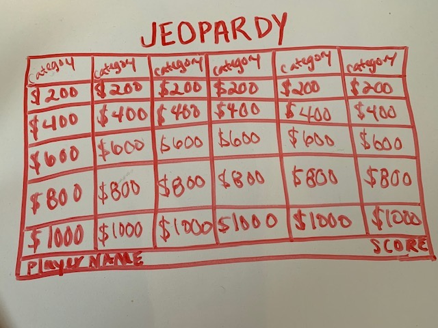

# Jeopardy Project
## Overview
### First Project at General Assembly, behold, the game of Jeopardy!
Once players come to the site, they are asked to input their names. The first player starts by choosing a category and then by choosing the level of difficulty of the question, for example $200 being a fairly easy question in comparision to clicking on a $1000 question. The player then clicks on that dollar amount and then an answer will appear, they will then have the option of choosing the right question that matches the answer. Player two then gets a turn. Points accrue when a question is answered correctly. Players alternate taking turns. The game is over when each value amount has been selected and answered. Good luck! 

### Live site: 
(https://github.com/msommerfield/Jeopardy.git "Play Jeopardy!")

## Technologies Used
* Languages - HTML5, CSS3, Javascript, jQuery
* Design - Google Fonts
* Project Planning & User Stories - 
(https://trello.com/b/SJzPwKg5/jeopardy-project-1 "Trello")
* Visual Studio Code

## Features

## Wireframe

## Future Development
* Add AI 
* Add a bonus round with new cateogries 